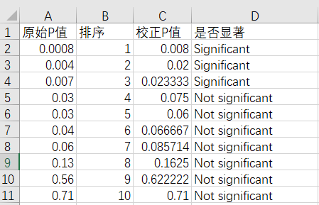

# Excel中进行Benjamini-Hochberg校正

整个过程涉及排序、计算校正后的阈值，然后根据阈值确定显著性水平。
假设你有一系列p值，需要对其进行Benjamini-Hochberg校正。假设以下数据存储在Excel工作表中的A列：
0.0008
0.004
0.007
0.03
0.03
0.04
0.06
0.13
0.56
0.71

## 步骤 1：对p值进行排序
首先需要将p值从小到大排序。
1. 选择p值所在列（假设在A2到A11）。
2. 在Excel中，选择“数据”选项卡，然后选择“排序”按钮。
3. 按“升序”排序。

## 步骤 2：计算排序位置
为了计算校正后的阈值，需要知道每个p值的排序位置。你可以在B列中插入序列号。
1. 在B2中输入数字“1”。
2. 在B3中输入公式 `=B1 + 1`，然后将其向下填充到B11。这将自动生成1到10的排序位置。

## 步骤 3：计算校正后的p值

Benjamini-Hochberg校正的公式是：

adjusted p-value=𝑘×𝑝𝑖/𝑖

其中，𝑘是总的检验次数，𝑝𝑖是第𝑖个排序后的p值，𝑖是该p值的排序位置。

设定显著性水平为0.05，或者根据研究需求调整。

在C2输入计算校正后的p值的公式：

= (k * A2) / B2
此例中k=10，然后将该公式向下填充到C11。校正后p值<0.05则认为显著。可以在E2输入以下公式实现：

=IF(C2<0.05,"Significant","Not significant")
完成后如下图所示：
