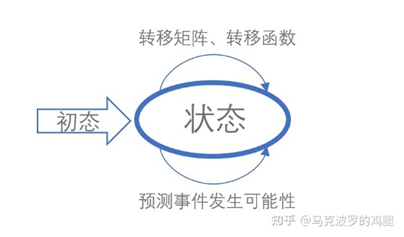

# 数据结构与算法(Data Structures and Algorithms)

* Learn Data Structures and Algorithms: https://www.geeksforgeeks.org/learn-data-structures-and-algorithms-dsa-tutorial/

## DP

## HMM
马尔可夫模型是一个很大的概念，从模型的定义和性质来看，具有马尔可夫性质、并以随机过程为基础模型的随机过程/随机模型被统称为马尔可夫模型。其中就包含我们悉知的马尔可夫链、马尔可夫决策过程、隐马尔可夫链（HMM）等随机过程/随机模型。
马尔可夫过程（Markov process）是一类随机过程。它的原始模型马尔可夫链，由俄国数学家A.A.马尔可夫于1907年提出。该过程具有如下特性：在已知目前状态（现在）的条件下，它未来的演变（将来）不依赖于它以往的演变 (过去)。在现实世界中，有很多过程都是马尔可夫过程，如液体中微粒所作的布朗运动、传染病受感染的人数、车站的候车人数等，都可视为马尔可夫过程。

每个状态的转移只依赖于之前的n个状态，这个过程被称为1个n阶的模型，其中n是影响转移状态的数目。最简单的马尔可夫过程就是一阶过程，每一个状态的转移只依赖于其之前的那一个状态，这个也叫作马尔可夫性质。用数学表达式表示就是下面的样子：
P(Xn+1|X1=x1,X2=x2,…,Xn=xn)=P(Xn+1=x|Xn=xn)
则X被称为马尔可夫链，可数集s被称为状态空间(state space)，马尔可夫链在状态空间内的取值称为状态。Xn=i表示随机过程在n时刻处在i状态，所有状态的取值构成的集合称为“状态空间”，以符号I表示。
把在当前时刻状态到下一时刻某状态的条件概率称作转移概率。

若一个马尔可夫链的状态空间是有限的，则可在单步演变中将所有状态的转移概率按矩阵排列，得到转移概率矩阵：

假设天气服从马尔可夫链：
从上面这幅图可以看出：
    假如今天是晴天，明天变成阴天的概率是0.1
    假如今天是晴天，明天任然是晴天的概率是0.9，和上一条概率之和为1，这也符合真实生活的情况。
晴 	阴
晴 	0.9 	0,1
阴 	0.5 	0.5

因此，一阶马尔可夫过程定义了以下三个部分：
* 状态：晴天和阴天
* 初始向量：定义系统在时间为0的时候的状态的概率
* 状态转移矩阵：每种天气转换的概率

马尔可夫模型（Markov Model）是一种统计模型，广泛应用在语音识别，音字转换，概率文法等各个自然语言处理等应用领域。它的数学基础是随机过程理论，即一个离散事件系统，有很多种状态，状态之间按条件转移，状态间的转移是有概率的，转移的过程符合马尔可夫性质，即转移只与当前状态相关，而与以前的状态无关。时间和状态都是离散的，也叫马尔可夫链。

在某些情况下马尔科夫过程不足以描述我们希望发现的模式。回到之前那个天气的例子，一个隐居的人可能不能直观的观察到天气的情况，但是有一些海藻。民间的传说告诉我们海藻的状态在某种概率上是和天气的情况相关的。在这种情况下我们有两个状态集合，一个可以观察到的状态集合（海藻的状态）和一个隐藏的状态（天气的状况）。我们希望能找到一个算法可以根据海藻的状况和马尔科夫假设来预测天气的状况。这个算法就叫做隐马尔可夫模型(HMM)。
隐马尔可夫模型 (Hidden Markov Model) 是一种统计模型，用来描述一个含有隐含未知参数的马尔可夫过程。对应的情况是状态不能直接观测到，叫作隐藏状态，而能观测到的是另一组变量，而这组变量又与隐藏状态有概率对应关系，所以是一个双随机过程。它是结构最简单的动态贝叶斯网，这是一种著名的有向图模型，主要用于时序数据建模，在语音识别、自然语言处理等领域有广泛应用。

